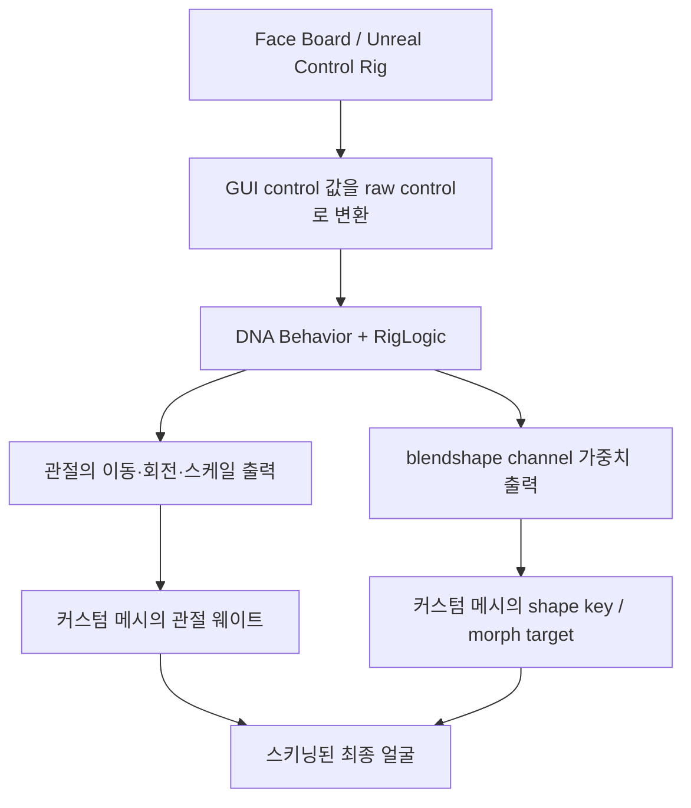
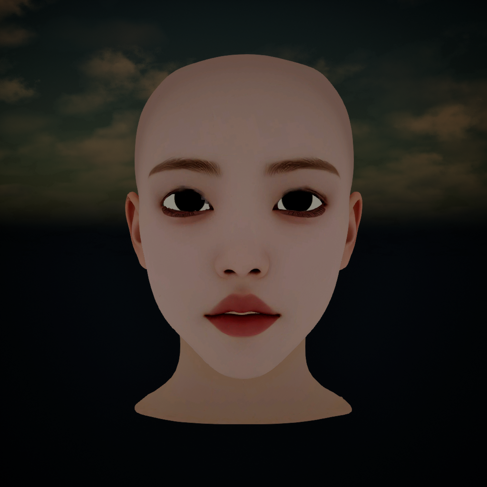
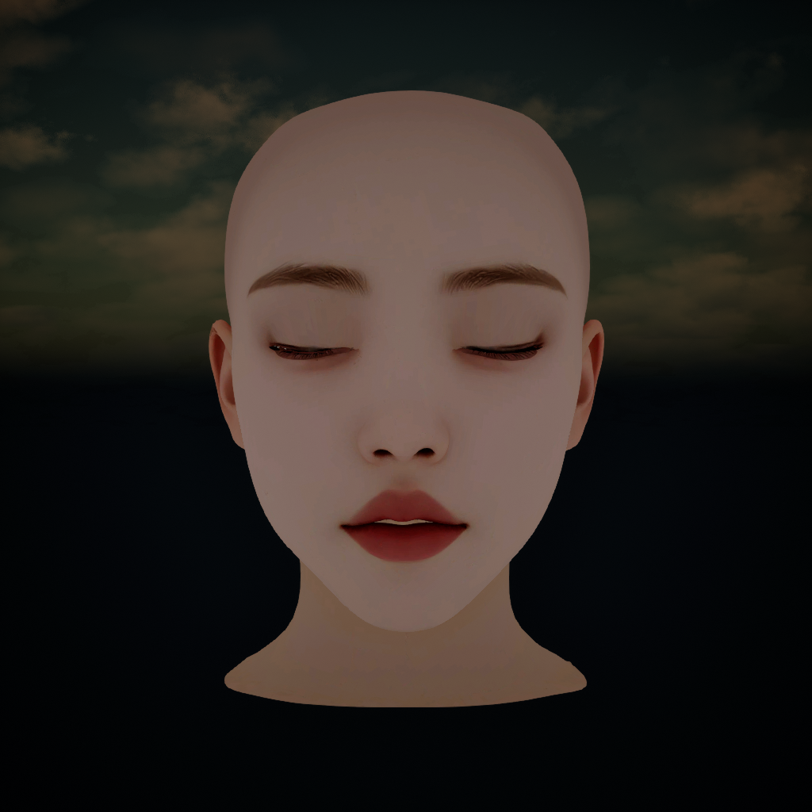
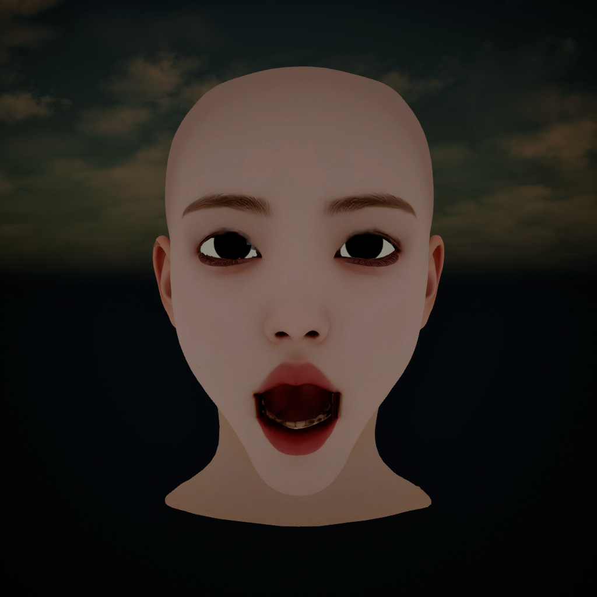
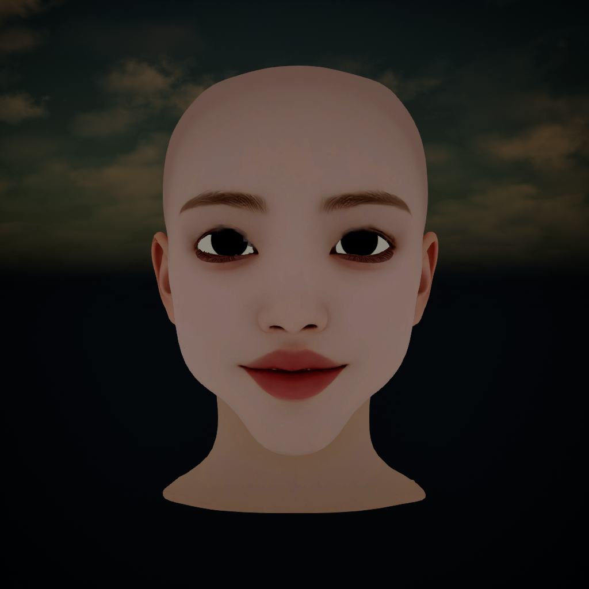

# 커스텀 토폴로지에 MetaHuman DNA·스키닝·RigLogic을 적용한 구현 기록

작성일: 2026-10-07 KST<br>
대상 프로젝트: `D:/Work/UnrealProjects/DeadHorizon`<br>
대상 메시: Tripo P2로 생성한 `Head_P2.blend`<br>
문서 기준: 실제 사용한 Python 스크립트, 저장된 Blender/DNA/FBX, Unreal 에디터 검증 JSON

이 구현은 커스텀 얼굴의 정점·면·UV를 기준으로 MetaHuman의 관절 웨이트와 표정 변위를 전달하고, 그 결과를 읽도록 커스텀 DNA를 구성한다. MetaHuman의 얼굴 제어 체계를 이용하면서 사용자가 만든 얼굴 표면을 유지하는 것이 목적이다.

문서는 **이번 P2 모델을 다시 만드는 절차**와 **다른 커스텀 모델에 적용할 때 다시 결정할 항목**을 함께 설명한다. 스크립트에는 이번 모델의 경로, 오브젝트 이름, 공간 좌표가 들어 있다. 임의의 메시를 넣으면 자동으로 완성되는 범용 리거로 취급하면 안 된다.

> **저장소 구성:** 문서, 재현용 Python 스크립트(`tools/`), 검증 JSON(`verification/`), 검수 화면을 포함한다. 원본 메시, donor DNA, 완성 BLEND/DNA/FBX, Unreal 프로젝트와 플러그인은 포함하지 않는다. 재현하려면 해당 입력을 별도로 준비해야 한다. 문서의 `D:/...` 경로는 작업 당시 예시이며 `YOUR_USER`와 각 경로를 본인 환경에 맞게 수정한다. 저장소의 `tools/` 파일은 문서에서 지정한 작업 폴더의 `Tools/`로 복사해 사용한다.

## 1. 결과와 보존 범위

| 항목 | 실제 결과 / 허용 범위 |
|---|---|
| 원본 파일 | 원본 `Head_P2.blend`의 SHA256 유지 |
| 원본 메시 | 18,409 정점, 19,389 면; 쿼드 16,867개와 삼각형 2,522개 |
| 남긴 얼굴·목 및 구강 조각 | 16,880 정점, 17,656 면 |
| 표면 보존 | 남긴 정점은 동일한 좌표계 변환만 적용. 남긴 각 면의 원본 정점 순서와 UV 일치 |
| 눈 수정 | 사용자가 눈 주변 연결 수정 및 별도 안구 사용을 명시적으로 허용 |
| 제거한 원본 면 | 눈 영역 1,733개 |
| 새 안구 | 좌우 각각 770 정점, 별도 UV·머티리얼 |
| 최종 DNA | 관절 870개, raw control 269개, blendshape channel 782개 |
| 메시별 shape key | 얼굴 778개, 왼쪽 안구 2개, 오른쪽 안구 2개. Basis 제외 |
| Unreal 뼈 | 보조 뼈 포함 876개 |
| 지원 대상으로 확인한 환경 | Blender 5.2.2 LTS, Unreal Engine 5.7.4, Windows용 Character DNA 네이티브 바인딩 |
| 엔진용 면 구성 | FBX/Unreal 런타임에서 삼각형으로 변환. Blender 편집본에는 남긴 원본 쿼드 유지 |
| 시각 품질 | 기본·턱 열기·눈 감기·미소 확인. 눈꺼풀 경계와 구강 내부는 추가 아트 보정 여지 있음 |

여기서 ‘보존’은 **눈 수정 후 남은 표면의 원본 대응 관계**를 뜻한다. 제거한 눈 면과 새 안구까지 포함한 전체 토폴로지가 원본과 동일하다는 뜻으로 기록하지 않는다. 정점 삭제로 작업본 정점 번호는 다시 매겨지므로, 원본 번호를 별도 속성에 저장했다.

## 2. 최종 파일과 근거 자료

이하 `SourceArt` 경로의 기준은 프로젝트 루트다.

| 용도 | 경로 |
|---|---|
| 원본 | `D:/ChatGPT/Resource/Head/Tripo_P2_20261006/Head_P2.blend` |
| 작업 루트 | `SourceArt/Characters/HeadP2MetaHuman/PreserveTopology/` |
| 최종 Blender | `HeadP2_Rig.blend` — 로컬 생성 산출물 |
| 최종 DNA | `HeadP2_Complete.dna` — 로컬 생성 산출물 |
| Unreal용 FBX | `HeadP2_Complete_CM.fbx` — 로컬 생성 산출물 |
| 안구 텍스처 | `PreserveTopology/HeadP2_Eye_Albedo.png` |
| 얼굴 PBR 텍스처 | `SourceArt/Characters/HeadP2MetaHuman/Textures/` |
| 채널 이름 대응표 | [channel_alias_map.json](../verification/channel_alias_map.json) |
| 전체 검증 | [final_verification.json](../verification/final_verification.json) |
| 실행 스크립트 | [Tools 디렉터리](../tools/) |
| 최종 Unreal 메시 | `/Game/Characters/HeadP2MetaHuman/Rig/HeadP2/SK_HeadP2` |
| 최종 Unreal 스켈레톤 | `/Game/Characters/HeadP2MetaHuman/Rig/HeadP2/SK_HeadP2_Skeleton` |
| 최종 컨트롤 시퀀스 | `/Game/Characters/HeadP2MetaHuman/Rig/HeadP2/LS_HeadP2_FaceControls` |

`Rig/Final`, `Rig/Delivery`, 초기 `Candidate` 파일은 중간 실험 결과다. 최종 Unreal 경로는 **`Rig/HeadP2`**다. `HeadP2_Complete.fbx`도 중간 산출물이며 엔진 임포트에는 **`HeadP2_Complete_CM.fbx`**를 사용한다.

## 3. 얼굴이 움직이는 데이터 흐름



각 데이터의 역할은 다음과 같다.

- **토폴로지·Basis 좌표·UV:** 사용자가 만든 얼굴의 기본 형태와 텍스처 대응을 유지한다.
- **스키닝 웨이트:** 관절이 움직일 때 어떤 정점이 얼마나 따라갈지 결정한다.
- **표정 변위:** 관절만으로 표현하기 어려운 입술·눈꺼풀 등의 보정을 정점별로 추가한다.
- **DNA Definition/Behavior:** 컨트롤, 관절, 표정 채널의 정의와 계산 관계를 제공한다.
- **DNA Geometry:** 커스텀 메시의 정점, 웨이트, 표정 target 등을 기록한다.
- **Face Board / Control Rig:** 사람이 조작하는 입력 장치다. 컨트롤러 이름과 값의 규칙을 donor와 맞춘다.
- **RigLogic:** 현재 컨트롤 값으로 DNA의 동작 규칙을 평가한다.

개념적으로 표정 적용 전 좌표를 `p`, 표정 변위를 `Δk`, 표정 가중치를 `αk`라 두면:

```text
p_morph = p + Σk αk · Δk
p_final ≈ Σj wj · (관절 j의 현재 변환 × bind 역변환) · p_morph
```

위 식은 전달해야 하는 두 종류의 데이터, 즉 `wj`와 `Δk`를 설명하는 개념식이다. 실제 평가는 Blender의 shape key/Armature와 Unreal의 morph/skinning 경로가 담당한다.

## 4. 준비 환경과 donor

### 4.1 설치와 프로젝트 준비

- Blender 실행 파일: `C:/Program Files/Blender Foundation/Blender 5.2/blender.exe`
- Character DNA 모듈: `bl_ext.api_portal_polyhammer_com.character_dna`
- 이번 환경의 네이티브 바인딩: `windows/x64/py313`
- Unreal 프로젝트: `D:/Work/UnrealProjects/DeadHorizon/DeadHorizon.uproject`
- MetaHuman/MetaHumanCharacter 플러그인 활성화, Python 에디터 스크립트 사용 가능 상태
- 다음 플러그인 에셋이 실제로 로드되는지 확인:
  - `/MetaHumanCharacter/Face/ABP_Face_PostProcess`
  - `/MetaHumanCharacter/Face/Face_ControlBoard_CtrlRig`

애드온의 설치 경로는 저장소 ID에 따라 달라질 수 있다. 이번 모듈 이름을 다른 환경에 그대로 적용하기 전에 설치된 모듈 이름을 확인한다. 이 문서의 Python API는 설치된 애드온 소스를 기준으로 하며 다른 버전에서의 동일 동작은 검증하지 않았다.

### 4.2 사용한 DNA

```text
C:/Users/YOUR_USER/Documents/Megascans Library/Downloaded/UAssets/
9qipkIPG/Tier0/asset_ue/MetaHumans/Ettore/SourceAssets/Ettore.dna
```

실제 파일 경로는 위 두 줄을 합친 경로다. 다른 작업자는 사용할 수 있는 donor DNA를 준비하고 스크립트의 경로를 수정해야 한다. 프로젝트 재현 시 donor 파일도 별도로 필요하다.

이 donor에서 확인한 데이터:

| 항목 | 수 |
|---|---:|
| 관절 | 870 |
| Raw controls | 269 |
| Blendshape channels | 782 |
| Head LOD0 targets | 737 |
| Teeth LOD0 targets | 41 |
| Eye LOD0 targets | 각 2 |
| Cartilage targets | 76; 다른 메시와 채널 공유 |

LOD0에서 명시적으로 생성한 전체 target은 858개였다. 최종 출력은 얼굴과 두 안구만 포함하고, 구강 조각은 얼굴 메시 안에서 처리한다. 따라서 최종 target 합계는 `737 + 41 + 2 + 2 = 782`다. **채널 수와 여러 메시의 target 수 합계는 일반적으로 다를 수 있다.**

엔진에 포함된 archetype DNA 후보에서는 표정 target이 0개인 것을 확인했다. donor 이름만 확인하지 말고 `getBlendShapeTargetCount()`로 실제 데이터가 있는지 검사한다.

## 5. 원본을 보존하고 작업본을 만드는 방법

관련 스크립트:

- [headp2_preserve_prepare.py](../tools/headp2_preserve_prepare.py)
- [mesh_fingerprint.py](../tools/mesh_fingerprint.py)

준비 스크립트는 원본 메시 수와 정점/면 수를 검사하고, 원본 파일 SHA256과 메시 지문을 저장한다. 작업본을 저장한 뒤 다시 열어 동일성을 확인한다. 기존 작업본이 있으면 덮어쓰기를 거부한다.

눈 수정 후에는 다음 속성을 추가한다.

| 속성 | 도메인 | 의미 |
|---|---|---|
| `p2_source_vertex` | POINT / INT | 작업본 정점이 대응하는 원본 정점 번호 |
| `p2_source_face` | FACE / INT | 작업본 면이 대응하는 원본 면 번호 |
| `p2_source_component` | POINT / INT | 원본의 연결 컴포넌트 번호 |

면 단위로 보존 여부를 확인할 때는 작업본의 면 정점 번호를 `p2_source_vertex`로 역매핑한 다음 원본 면의 정점 순서와 비교한다. UV는 정점당 하나로 비교하지 않고 **face corner/loop 단위**로 비교한다. 하나의 정점이 UV seam 양쪽에서 서로 다른 UV를 가질 수 있기 때문이다.

## 6. 원본 분리 구조와 눈 수정

관련 스크립트: [headp2_eye_repair.py](../tools/headp2_eye_repair.py)

원본의 에지 연결을 union-find로 분석하고, 연결 컴포넌트를 정점 수 내림차순으로 정렬했다.

| ID | 정점 수 | 이번 모델에서의 역할 |
|---|---:|---|
| 0 | 15,519 | 얼굴·목, 한쪽 안구가 연결된 주 표면 |
| 1 | 912 | 아래 치아 |
| 2 | 895 | 위 치아 |
| 3 | 797 | 분리돼 있던 다른 쪽 안구 |
| 4 | 143 | 혀/구강 내부 조각 |
| 5 | 90 | 분리된 위 눈꺼풀 띠 |
| 6 | 53 | 위 치아 조각 |

컴포넌트 3 전체와, 주 표면에 붙어 있던 다른 쪽 안구의 지정 영역을 제거했다. 남긴 면의 좌표·정점 순서·재질 인덱스·smooth 설정·loop UV는 원본에서 복사했다.

이번 모델의 영역 선택은 원본 좌표를 고정된 진단 화면 좌표로 바꿔 판정한다.

```python
pixel_x = 400 + center.y / 0.00115
pixel_y = 500 - center.z / 0.00115
# center.x > .12인 면 중, 코드에 기록한 눈 윤곽 polygon 내부의 면 제거
```

정확한 12개 윤곽점은 스크립트의 `contour` 배열에 기록돼 있다. 이 좌표와 컴포넌트 ID는 **이번 원본에만 적용되는 값**이다. 다른 모델에서는 실제 눈 경계를 다시 지정해야 한다.

### 6.1 좌표 정렬

원본은 Blender에서 얼굴이 +X 방향을 향했다. donor 공간으로 맞추기 위해 다음 변환을 적용했다.

```text
x_target =  0.25 · y_source
y_target = -0.25 · x_source - 0.03
z_target =  0.25 · z_source + 1.594
```

단위는 donor를 미터 단위로 다루는 Blender 작업 공간이다. 행렬로는 `Translation(0,-.03,1.594) × RotationZ(-90°) × Scale(.25)`다.

눈 수정 단계에서는 오브젝트 행렬에 저장하고, 전달 단계에서 mesh data에 적용한 뒤 오브젝트 행렬을 Identity로 만든다. 이 일괄 변환을 제외한 얼굴·목 Basis의 개별 정점 이동은 수행하지 않았다.

### 6.2 별도 안구

donor 안구 메시를 복사하고 중심 기준으로 1.35배 확대했다. 새 중심은 다음과 같다.

```text
Left:  (+0.0325, -0.08525, 1.6175)
Right: (-0.0325, -0.08525, 1.6175)
```

좌우 명칭은 donor 기준이다. 안구별 기존 shape delta도 1.35배 적용하고, `FACIAL_L_EyeParallel` / `FACIAL_R_EyeParallel` 및 자식 관절의 위치를 새 중심에 맞춰 함께 이동한다. 축 방향은 유지한다.

## 7. donor 메시·관절·Face Board 가져오기

관련 스크립트:

- [headp2_ettore_import.py](../tools/headp2_ettore_import.py)
- [headp2_donor_shapes.py](../tools/headp2_donor_shapes.py)

LOD0만 가져오며 메시, 관절, 웨이트, shape key, Face Board를 요청한다. Body는 제외했다.

```python
kwargs = {f'import_lod{i}': i == 0 for i in range(8)}
bpy.ops.character_dna.import_dna(
    filepath=str(source), import_mesh=True, import_bones=True,
    import_shape_keys=True, import_vertex_groups=True,
    import_materials=False, import_face_board=True,
    include_body=False, **kwargs)
```

이번 환경에서는 import 옵션에 `import_shape_keys=True`를 줘도 기대한 shape key가 생성되지 않았다. 따라서 DNA reader에서 target을 직접 순회하며 생성했다.

```python
for mesh_index in reader.getMeshIndicesForLOD(0):
    obj = instance.head_mesh_index_lookup.get(mesh_index)
    if not obj:
        continue
    mesh_name = reader.getMeshName(mesh_index)
    for target in range(reader.getBlendShapeTargetCount(mesh_index)):
        channel = reader.getBlendShapeChannelIndex(mesh_index, target)
        io.create_shape_key(
            index=target, mesh_index=mesh_index, mesh_object=obj,
            reader=reader, name=reader.getBlendShapeChannelName(channel),
            prefix=mesh_name + '__', linear_modifier=.01)
```

완료 후 `Ettore_Donor_Full.blend`를 저장한다. donor 자체에서 턱·눈 감기·미소가 관절과 shape key를 동시에 움직이는지 먼저 확인한다. 전달 전에 donor가 정상 작동해야 실패 원인을 구분할 수 있다.

## 8. 표면 대응과 스키닝 웨이트 전달

관련 스크립트: [headp2_transfer_rig_v2.py](../tools/headp2_transfer_rig_v2.py)

### 8.1 donor를 대응 검색용으로 맞추기

눈과 입의 비율 차이를 줄이기 위해 donor 좌표에 부드러운 공간 변형 함수 `W(p)`를 정의했다. 커스텀 얼굴의 Basis는 유지하고 donor의 검색 표면과 donor 표정 변위 계산에 같은 함수를 사용한다.

눈 주변 각 측면 `s ∈ {-1,+1}`:

```text
center = (s·.0292, -.096, 1.617)
r = p - center
falloff = exp(-1.5 · sum((r / (.032,.04,.026))²))
shift = (.25·rx + s·.0033, -.003, .6·rz + .0005)
W(p)에 shift · falloff를 더함
```

입 주변:

```text
center = (0, -.112, 1.546)
r = p - center
falloff = exp(-1.5 · sum((r / (.035,.035,.022))²))
shift = (-.12·rx, 0, .4·rz + .002)
W(p)에 shift · falloff를 더함
```

이 값들은 눈 크기·입 위치가 다른 이번 P2 얼굴에 맞춘 파라미터다. 다른 얼굴에서는 중립 표면과 진단 렌더를 비교해 다시 조정한다.

### 8.2 메시 영역별 donor 선택

- 컴포넌트 `[1,2,4,6]`: donor `teeth_lod0_mesh`에서 대응 검색.
- 나머지 컴포넌트: donor `head_lod0_mesh`에서 대응 검색.

얼굴/구강의 가까운 면끼리 잘못 대응되는 범위를 줄이기 위해 검색 공간을 나눴다. 원본 면을 삼각형으로 교체할 필요는 없다. donor의 `loop_triangles`만 BVH 검색에 사용한다.

### 8.3 최근접 삼각형과 법선 조건

각 target 정점 `q`에서 `W(donor_basis)`의 최근접 삼각형을 찾는다. 최초 최근접 거리보다 3mm 더 넓은 범위에서 후보를 모은 후 다음 점수가 가장 작은 후보를 선택한다.

```text
score = distance² + [0.004 · (1 - clamp(targetNormal · triangleNormal, -1, 1))]²
```

거리만 사용하는 경우 입술 안쪽/바깥쪽, 위/아래 눈꺼풀이 섞일 수 있다. 법선 항은 반대쪽 표면을 선택할 가능성을 줄인다. 그럼에도 자동 대응의 오류가 남을 수 있으므로 눈꺼풀과 치아는 별도 보정했다.

### 8.4 Barycentric 좌표와 웨이트

선택한 삼각형의 정점 `a,b,c`, 삼각형 위 최근접점 `h`에 대해:

```text
v0=b-a, v1=c-a, v2=h-a
d00=v0·v0, d01=v0·v1, d11=v1·v1
den=d00·d11-d01²
β=(d11·(v2·v0)-d01·(v2·v1))/den
γ=(d00·(v2·v1)-d01·(v2·v0))/den
α=1-β-γ
```

퇴화 삼각형은 `(1,0,0)`으로 처리하고, 계산값은 `[0,1]`로 clamp한 뒤 합이 1이 되도록 정규화한다.

관절 `j`의 target 웨이트:

```text
w_target[j] = α·w_a[j] + β·w_b[j] + γ·w_c[j]
```

실제 후처리:

1. `1e-5` 이하의 영향 제거.
2. 큰 웨이트 순으로 최대 12개 유지.
3. 남은 웨이트 합으로 나눠 정규화.
4. 총합이 0인 정점은 오류 처리.
5. vertex group 이름을 donor 관절 이름과 동일하게 유지.

초기 대응의 실제 거리:

| donor | 대응 정점 수 | 중앙값 | 최대값 |
|---|---:|---:|---:|
| Head | 14,877 | 약 2.715mm | 약 25.991mm |
| Teeth | 2,003 | 약 2.437mm | 약 10.679mm |

스크립트는 중앙값이 4cm를 넘으면 중단한다. 이 조건은 큰 정렬 오류 검출용이며, 개별 눈꺼풀·입술의 품질 통과를 보장하지 않는다.

## 9. Shape key 전달과 관절 위치 정렬

### 9.1 표정 변위 전달

donor Basis를 `p`, 표정 target 좌표를 `pk`라 하면 전달용 변위는 다음과 같다.

```text
Δdonor,k = W(pk) - W(p)
Δtarget,k = α·Δa,k + β·Δb,k + γ·Δc,k
TargetShapeKey[k] = TargetBasis + Δtarget,k
```

따라서 donor를 얼굴 비율에 맞춘 효과가 표정 변위에도 반영된다. target의 중립 얼굴을 donor 얼굴로 바꾸는 과정은 없다.

Head의 737개 target과 Teeth의 41개 target을 하나의 target 얼굴 mesh에 결합했다. 각 표정 배열은 target 전체 정점 수와 같고, 해당 donor에서 전달하는 영역에만 delta를 기록한다.

### 9.2 중립 관절 위치

각 donor edit bone의 head를 `W(head)`로 이동시키고, 같은 offset을 tail에도 더한다.

```python
offset = W(bone.head) - bone.head
bone.head += offset
bone.tail += offset
```

이동량을 같게 적용해 bone의 방향과 길이를 유지한다. 관절 이름·계층·인덱스 관계를 보존하며 중립 위치를 얼굴 비율에 맞춘다. 기존 donor 리그 인스턴스의 head mesh data를 target data로 교체하므로 Face Board와 리그 연결 정보도 유지된다.

## 10. 치아와 눈꺼풀의 보정

### 10.1 치아 강체 바인딩

관련 스크립트: [headp2_teeth_fix.py](../tools/headp2_teeth_fix.py)

최근접 전달만으로 치아를 바인딩하면 위·아래 턱 웨이트가 섞여 치아가 늘어날 수 있다. 치아 컴포넌트는 기존 웨이트를 제거하고 다음 관절에 1.0으로 바인딩했다.

| 컴포넌트 | 관절 |
|---|---|
| 1 | `FACIAL_C_TeethLower` |
| 2, 6 | `FACIAL_C_TeethUpper` |

이 정점들은 모든 shape key에서 Basis 좌표로 되돌려 표정 delta를 0으로 만들었다. 치아 위치 변화는 관절이 담당한다. 컴포넌트 4의 구강 조각은 이 강체 처리에서 제외했다.

### 10.2 눈꺼풀 웨이트·delta 평활화

관련 스크립트: [headp2_eye_weights.py](../tools/headp2_eye_weights.py)

이번 모델의 처리 범위:

```text
.009 < abs(x) < .065
1.598 < z < 1.647
y < -.079
component ∈ {0,5}
```

총 4,472개 정점이 해당했다.

- 연결 에지를 이용해 이웃을 구성한다.
- 분리된 눈꺼풀 띠(컴포넌트 5)는 얼굴 컴포넌트 0의 최근접 정점 3개를 추가 이웃으로 사용한다.
- 웨이트는 `0.6·현재 + 0.4·이웃 평균`을 3회 적용한다.
- 다시 상위 12개 영향만 유지하고 정규화한다.
- Shape delta는 `0.65·현재 + 0.35·이웃 평균`을 2회 적용한다.

평활화 대상은 웨이트와 표정 delta다. Basis 좌표나 UV seam을 용접하지 않는다. 눈꺼풀의 세밀한 접촉은 극단 포즈에서 별도 아트 보정이 필요할 수 있다.

## 11. 커스텀 DNA 구성과 채널 누락 해결

관련 스크립트:

- [headp2_finalize_blender.py](../tools/headp2_finalize_blender.py)
- [headp2_complete_channels.py](../tools/headp2_complete_channels.py)

### 11.1 초기 커스텀 DNA 내보내기

Character DNA의 `DNAExporter`를 사용한다.

```python
instance.output.method = 'overwrite'
result = io.DNAExporter(
    instance=instance, linear_modifier=.01,
    file_name='HeadP2_Rig.dna', component_type='head',
    textures=False, vertex_colors=False, seam_follower=None).run()
```

출력 대상에는 커스텀 head mesh, head rig, 좌우 안구만 포함한다. donor의 별도 치아·속눈썹·eyeshell 등 보조 표면은 최종 출력에서 제외했다. donor의 동작 정의를 기반으로 커스텀 geometry와 중립 관절을 갖춘 DNA를 만든다.

### 11.2 두 가지 실제 문제

1. Blender shape key 이름이 길어지면 63자 제한에 걸려 이름이 잘리거나 `.001`이 붙었다. FBX 이름 변환까지 더해지면 DNA 채널 이름과 morph 이름이 어긋날 수 있다.
2. 애드온의 overwrite 경로가 원래 Head target 737개 기준으로 처리하면서, Head에 합친 Teeth target 41개를 완전히 기록하지 못했다.

해결은 최종 DNA의 target과 channel mapping을 명시적으로 다시 작성하는 것이었다.

### 11.3 채널 인덱스 유지와 짧은 이름

원본 donor의 채널 인덱스 `j`를 유지하면서 이름을 다음과 같이 바꾼다.

```text
Channel: p2_bs_0000 ... p2_bs_0781
Head key: head_lod0_mesh__p2_bs_NNNN
Eye key: eyeLeft_lod0_mesh__p2_bs_NNNN 등
```

원래 채널 이름과 alias는 `channel_alias_map.json`에 저장한다. GUI/raw control 이름은 그대로 유지한다. 이 방식에서는 DNA Behavior가 출력하는 채널 **인덱스**와 Geometry mapping이 일치해야 한다.

### 11.4 DNA writer 작업 순서

1. 기존 커스텀 DNA 전체를 `writer.setFrom(..., DataLayer_All, UnknownLayerPolicy_Preserve, None)`으로 복사.
2. 모든 채널 이름을 짧은 alias로 변경.
3. 원본 donor에서 Head target 채널 순서와 Teeth target 채널 순서를 읽어 합침.
4. `clearMeshBlendShapeChannelMappings()` 실행.
5. 메시마다 `clearBlendShapeTargets(meshIndex)` 실행.
6. 각 shape key delta에서 길이가 `1e-9 m`보다 큰 정점만 선택.
7. 채널 인덱스, 정점 인덱스, delta, mesh/channel mapping을 명시적으로 기록.
8. 저장 후 reader로 다시 열어 메시별 target 수를 확인.

핵심 writer API:

```python
writer.setBlendShapeChannelIndex(...)
writer.setBlendShapeTargetVertexIndices(...)
writer.setBlendShapeTargetDeltas(...)
writer.setMeshBlendShapeChannelMapping(...)
```

Blender delta를 DNA 좌표로 변환하는 식:

```text
DNA delta = 100 · (Blender Δx, Blender Δz, -Blender Δy)
```

이 축 변환은 이번 Character DNA 파이프라인의 DNA 공간을 위한 것이다. 뒤의 Unreal 관절 비교에 사용하는 `(x,-y,z)`와 목적이 다르다.

실행 전 shape key 수와 source 채널 순서가 맞는지 검사한다. 이 스크립트는 `HeadP2_Rig_Work.blend`의 생성 순서를 전제로 하므로 shape key를 수동 재정렬한 작업본에는 그대로 사용하지 않는다.

## 12. 얼굴·안구 머티리얼

### 12.1 얼굴 PBR

원본 packed image를 PNG로 추출했고, 원본 노드 연결을 `Textures/manifest.json`에 기록했다.

| 원본 이미지 접미사 | 용도 | Unreal 색 공간 |
|---|---|---|
| `_0` | Base Color | sRGB |
| `_1` | Roughness | Linear |
| `_2` | Metallic | Linear |
| `_3` | Normal | Linear / Normal map compression |

파일 번호로 추측하기 전에 manifest의 실제 연결을 확인한다. 해당 매핑은 이번 원본에서 확인한 값이다.

Unreal의 `M_HeadP2_Source`는 BaseColor/Normal에 RGB, Roughness/Metallic에 R을 연결한다. 원본 얼굴 UV는 그대로 유지한다. 검수용 `M_HeadP2_Tracking`은 BaseColor를 Emissive에 연결한 Unlit 재질이다.

### 12.2 안구 전용 UV와 재질

관련 스크립트: [headp2_eye_material.py](../tools/headp2_eye_material.py)

초기에는 원본 분리 안구의 atlas UV를 최근접 삼각형으로 전달했지만, 새 안구에서 조각난 텍스처가 나타났다. 최종 파일에는 안구 전용 평면 UV와 절차적으로 만든 텍스처를 적용했다.

```text
center = (bbox_min + bbox_max) / 2
D = max(x_extent, z_extent)
u = (x-center.x)/D + .5
v = (z-center.z)/D + .5
```

1024×1024 이미지에서 중심으로부터 반경 .27 이내를 어두운 갈색 홍채, .115 이내를 검은 동공, .25~.27을 바깥 테두리로 구성했다. 공막과 홍채 색, 방사형 패턴은 스크립트에 기록돼 있다. 안구 Roughness는 .22다. 원본 얼굴 텍스처를 다시 칠한 작업은 없다.

Blender 안구 UV와 함께 DNA의 `setVertexTextureCoordinates()` 및 vertex layout의 UV 인덱스도 갱신했다. 이 스크립트는 안구의 기존 정점 순서가 DNA 위치 인덱스와 일치한다는 전제를 사용한다. 새 topology의 안구로 바꾸면 이 인덱스 관계를 다시 검증해야 한다.

### 12.3 조명과 텍스처 검증의 구분

최종 PBR을 기존 `ZombieLands02` 조명에서 확인하면 강한 주황빛과 어두운 그림자가 발생했다. 원본 Roughness 평균은 약 .264로 번들거림도 있다. 이 상태를 텍스처 누락으로 판단하지 않는다.

- Unlit 확인: UV·색상·텍스처 연결 검증.
- Lit 확인: 조명·노출·거칠기·노멀·반사 검증.
- 머티리얼을 바꾼 직후 같은 에디터 호출에서 캡처하면 이전 재질이 렌더링될 수 있다. 재질 적용과 캡처를 나누고 에디터 프레임이 갱신된 뒤 촬영한다.

기존 레벨 조명의 미술적 수정은 이 리깅 작업에서 완료한 항목에 포함하지 않는다.

## 13. Blender에서 실제로 컨트롤러 사용하기

### 13.1 사용자 설정

1. `Edit → Preferences → Add-ons`에서 Character DNA를 **활성화**한다.
2. 환경설정을 저장한다.
3. `HeadP2_Rig.blend`를 연다.
4. `N → Character DNA`에서 리그 목록 왼쪽 체크와 `Head`가 켜졌는지 확인한다.
5. 뼈 평가와 Shape Key 평가가 켜졌는지 확인한다.
6. Head DNA 경로를 `HeadP2_Complete.dna`로 지정한다. 다른 PC로 옮기면 기존 절대 경로를 수정한다.
7. Face Board를 선택하고 **Pose Mode**에서 개별 컨트롤을 움직인다.

이번 전달 직후 발생한 문제는 **애드온이 설치됐으나 저장된 사용자 설정에서 비활성화된 상태**였다. 자동화 스크립트는 다음 호출로 해당 프로세스에서만 활성화했다.

```python
addon_utils.enable(module, default_set=False, persistent=False)
```

이는 일반 Blender 실행의 사용자 환경설정에 활성화 상태를 저장하지 않는다. 검증 스크립트에서 동작했다는 사실과 사용자가 파일을 열었을 때 동작한다는 사실을 따로 확인해야 한다.

### 13.2 작동 확인용 컨트롤

| 컨트롤 | Blender pose bone의 local Y 값 |
|---|---:|
| `CTRL_C_jaw` | .7 |
| `CTRL_L_eye_blink`, `CTRL_R_eye_blink` | 1.0 |
| `CTRL_L_mouth_cornerPull`, `CTRL_R_mouth_cornerPull` | .7 |

선택한 pose bone의 local location 값으로 테스트한다. 임의의 화면 방향으로 이동한 거리와 이 값이 항상 같은 의미를 갖는 것은 아니다. 원복은 local location을 0으로 설정한다.

저장된 리그에서는 `auto_evaluate=True`, `auto_evaluate_head=True`였다. 애드온을 활성화한 상태에서 `instance.evaluate()`를 직접 호출하지 않고 컨트롤 값 변경과 depsgraph 갱신만으로 턱 변형을 재확인했다.

### 13.3 초기화와 오류 확인

자동화에서 사용하는 초기화 순서:

```python
instance.head_dna_file_path = str(output / 'HeadP2_Complete.dna')
instance.destroy_references()
instance.head_initialize()
instance.auto_evaluate = True
instance.evaluate(component='head')
```

드라이버 오류에 `character_dna_native_solve_v1`가 나오면 먼저 애드온 활성화와 네이티브 바인딩 로딩 여부를 확인한다. 애드온 없이 열었을 때 해당 solver가 driver namespace에 없음을 재현했다. 스크립트 실행 차단 알림이 별도로 표시되는 경우에는 내용을 확인한 신뢰 가능한 작업 파일에 한해 Blender의 허용 절차를 따른다. 전역 보안 설정 해제를 필수 조건으로 두지 않는다.

## 14. FBX의 cm 변환과 Unreal 임포트

관련 스크립트:

- [headp2_export_centimeters.py](../tools/headp2_export_centimeters.py)
- [headp2_ue_final_import.py](../tools/headp2_ue_final_import.py)

### 14.1 단위 문제와 최종 해결

초기 FBX에서는 root scale 100 또는 매우 작은 메시가 나왔다. 단위 메타데이터 옵션만 바꾸는 것으로 해결되지 않았다.

최종 export는 저장된 Blender 파일을 임시 세션으로 연 다음:

```python
# 평가를 멈춘 뒤, 내보낼 head/eyes/armature만 대상으로 처리
mesh.data.transform(Matrix.Scale(100, 4), shape_keys=True)
armature.data.pose_position = 'REST'
armature.data.transform(Matrix.Scale(100, 4))
scene.unit_settings.system = 'METRIC'
scene.unit_settings.scale_length = .01
```

그 다음 FBX export 옵션을 다음과 같이 설정한다.

```python
bpy.ops.export_scene.fbx(
    filepath=str(output / 'HeadP2_Complete_CM.fbx'),
    use_selection=True, object_types={'MESH', 'ARMATURE'},
    use_mesh_modifiers=False, add_leaf_bones=False, bake_anim=False,
    use_armature_deform_only=False,
    apply_scale_options='FBX_SCALE_UNITS', apply_unit_scale=True,
    axis_forward='-Z', axis_up='Y', path_mode='AUTO', colors_type='NONE')
```

**이 세션의 Blender 파일은 저장하지 않는다.** 원래 미터 기반 편집본을 유지하며, cm용 데이터 변환은 FBX에만 반영한다. 실제 FBX UnitScaleFactor는 약 1이고 Unreal root scale은 `(1,1,1)`이었다.

### 14.2 임포트 설정

이번 작업에서는 legacy FBX importer를 사용했다. Interchange 임포트에서 `FSkeletalMeshAttributes::IsReservedAttributeName` 관련 ensure가 발생한 경로를 피하기 위해 다음 콘솔 변수를 임시로 바꾸고, `finally`에서 원래 값으로 복원했다.

```text
Interchange.FeatureFlags.Import.FBX 0
```

주요 옵션:

| 옵션 | 값 |
|---|---|
| Factory | `FbxFactory` |
| Import as Skeletal | True |
| Import Morph Targets | True |
| Import Materials / Textures | False; 재질은 별도로 연결 |
| Import Animations | False |
| Create Physics Asset | False |
| Convert Scene / Convert Scene Unit | True |
| Normal Import Method | Import Normals |
| Preserve Smoothing Groups | True |
| Morph Threshold Position | 0.0 |
| Add Leaf Bones | Blender export에서 False |

새 경로에 처음 가져오는 스크립트다. 기존 최종 에셋 위에 반복 실행하는 재임포트 도구로 사용하지 않는다. 초기 재임포트 실험에서는 이전 source filename을 계속 참조한 경우가 있어, 실제 import source 경로와 새 메시의 root scale을 검증했다.

### 14.3 DNAAsset 연결

임포트 대상으로 사용할 SkeletalMesh를 명시한다.

```python
task = unreal.AssetImportTask()
task.factory = unreal.DNAAssetImportFactory()
options = unreal.DNAAssetImportUI()
options.skeletal_mesh = mesh
task.options = options
task.filename = str(output / 'HeadP2_Complete.dna')
task.automated = True
task.save = True
unreal.AssetToolsHelpers.get_asset_tools().import_asset_tasks([task])
```

기존 importer UI의 이전 선택값에 의존하면 다른 메시로 연결될 수 있다. `mesh.asset_user_data`에 `DNAAsset`이 붙었는지 확인한다. DNA가 별도 Content Browser 에셋으로 보이는지보다 **대상 SkeletalMesh의 userdata 연결**이 검증 기준이다.

### 14.4 PostProcess와 Skeleton

```python
post = unreal.load_asset('/MetaHumanCharacter/Face/ABP_Face_PostProcess')
mesh.set_editor_property('post_process_anim_blueprint', post.generated_class())
skeleton = mesh.get_editor_property('skeleton')
skeleton.add_compatible_skeleton(post.get_editor_property('target_skeleton'))
```

호환 스켈레톤 등록은 원래 관절 이름·계층을 유지한 이 작업의 전제에서 사용한다. 임의의 스켈레톤에서 호환 목록만 추가한다고 DNA가 맞춰지지는 않는다.

재질은 `headp2_ue_assign_materials.py`에서 슬롯 이름에 `Eye`가 포함되면 `M_HeadP2_Eye`, 그 외에는 `M_HeadP2_Source`를 지정한다. 구조체 배열을 수정한 뒤 `slots[j] = slot`으로 다시 넣고 전체 `materials` 속성을 저장한다. 저장 후 각 슬롯의 실제 material path를 다시 확인한다.

## 15. Unreal Control Rig와 시퀀서

관련 스크립트:

- [headp2_ue_final_sequence.py](../tools/headp2_ue_final_sequence.py)
- [headp2_ue_final_keys.py](../tools/headp2_ue_final_keys.py)

1. 30fps, 0~120 프레임 범위의 Level Sequence를 만든다.
2. 임시 `SkeletalMeshActor`에 커스텀 SK를 할당한다.
3. 해당 액터에서 sequence spawnable binding을 만든다.
4. `/MetaHumanCharacter/Face/Face_ControlBoard_CtrlRig`를 로드한다.
5. `ControlRigSequencerLibrary.find_or_create_control_rig_track()`으로 binding에 연결한다.
6. 임시 액터는 제거하고 sequence의 spawnable로 재생한다.

테스트 키:

| 프레임 | 입력 |
|---:|---|
| 0 | 기본 |
| 20 | Jaw .7 |
| 40 | 기본 |
| 60 | 양쪽 Blink 1.0 |
| 80 | 기본 |
| 100 | 양쪽 Corner Pull .7 |
| 119 | 기본 |

Jaw는 `set_local_control_rig_vector2d(..., Vector2D(0,value))`, Blink/Corner Pull은 `set_local_control_rig_float()`로 설정했다. 검증 시 출력 raw curve `CTRL_expressions_jawOpen`, `CTRL_expressions_eyeBlinkL`, `CTRL_expressions_mouthCornerPullL`도 읽었다.

spawnable 액터는 일반 레벨 액터 열거에서 찾지 못할 수 있다. 시퀀스 binding GUID로 `LevelSequenceEditorBlueprintLibrary.get_bound_objects()`를 호출한다. 템플릿 컴포넌트는 `binding.get_object_template().get_editor_property('skeletal_mesh_component')`로 접근했다.

컴포넌트의 일부 메시 속성이 `None`이라고 바로 참조 단절을 판정하지 않는다. 실제 `get_num_bones()`, `get_post_process_instance()`, bone transform, curve 값과 화면 변형을 함께 확인한다.

## 16. 같은 모델을 다시 만드는 실행 순서

### 16.1 실행 전

- 최종 결과를 보존하고 별도 작업 디렉터리에서 재현한다.
- 스크립트의 `out`, `source`, donor 경로, 애드온 모듈 경로를 재현 환경에 맞춘다.
- `out/Tools`를 만들고 `mesh_fingerprint.py`를 포함한다.
- 스크립트의 파일 읽기/저장 경로를 일괄 점검한다. 중간 파일 이름도 단계 사이의 계약이다.
- 아래 스크립트는 모두 `SourceArt/Characters/HeadP2MetaHuman/PreserveTopology/Tools`에 보존돼 있다.

PowerShell에서 Blender 스크립트 하나를 실행하는 예:

```powershell
$BlenderExe = 'C:\Program Files\Blender Foundation\Blender 5.2\blender.exe'
$RigTools = 'D:\Work\UnrealProjects\DeadHorizon\SourceArt\Characters\HeadP2MetaHuman\PreserveTopology\Tools'
& $BlenderExe --background --python "$RigTools\headp2_ettore_import.py"
```

프로세스 종료 코드뿐 아니라 로그의 traceback과 기대 출력 파일도 확인한다. Blender 스크립트 예외가 발생했는데 프로세스가 정상 종료 코드로 끝난 사례가 있었다.

### 16.2 Blender 단계

| 순서 | 스크립트 | 입력 → 주요 출력 |
|---:|---|---|
| 1 | `headp2_preserve_prepare.py` | 원본 → `Head_P2_PreserveTopology_Work.blend`, 지문 JSON |
| 2 | `headp2_ettore_import.py` | Ettore DNA → `Ettore_Donor.blend` |
| 3 | `headp2_donor_shapes.py` | Donor → `Ettore_Donor_Full.blend` |
| 4 | `headp2_eye_repair.py` | 원본 작업본 + Full donor → `Head_P2_EyeRepair_Work.blend` |
| 5 | `headp2_transfer_rig_v2.py` | Full donor + EyeRepair → `Head_P2_Rig_Candidate_v2.blend`, v2 DNA |
| 6 | `headp2_teeth_fix.py` | v2 → `Head_P2_Rig_Candidate_v3.blend`, v3 DNA |
| 7 | `headp2_eye_weights.py` | v3 → `Head_P2_Rig_Candidate_v4.blend`, v4 DNA |
| 8 | `headp2_finalize_blender.py` | v4 → `HeadP2_Rig_Work.blend`, `HeadP2_Rig.dna` |
| 9 | `headp2_complete_channels.py` | Rig_Work + Rig DNA + donor DNA → `HeadP2_Rig.blend`, `HeadP2_Complete.dna` |
| 10 | `headp2_blender_workspace.py` | 편집 화면을 Face Board의 Pose Mode로 정리 |
| 11 | `headp2_eye_material.py` | 최종 Blender/DNA의 안구 UV·재질 갱신, PNG 생성 |
| 12 | `headp2_export_centimeters.py` | 最終 Blender → `HeadP2_Complete_CM.fbx` |
| 13 | `headp2_extract_textures.py` | 원본 packed image → PBR PNG와 manifest |

단계 8의 원본 안구 atlas 전송은 중간 처리다. 최종 안구는 단계 11로 갱신한다. 단계 9가 생성하는 이전 단위의 `HeadP2_Complete.fbx`는 사용하지 않고 단계 12의 `_CM.fbx`를 사용한다.

### 16.3 Unreal 재질 준비

프로젝트에 이미 있는 다음 에셋을 사용했다.

```text
/Game/Characters/HeadP2MetaHuman/Source/
  T_HeadP2_BaseColor, T_HeadP2_Roughness, T_HeadP2_Metallic, T_HeadP2_Normal
  M_HeadP2_Source, M_HeadP2_Tracking
  T_HeadP2_Eye, M_HeadP2_Eye, M_HeadP2_EyeTracking
```

새 프로젝트에서는 먼저 PNG를 가져와 12절의 색 공간과 연결대로 생성한다. 얼굴 PBR은 Default Lit, Tracking 재질은 Unlit, 안구 PBR roughness는 .22다. 후속 임포트 스크립트는 위 material asset들이 이미 있다는 전제다. 안구 재질은 보존한 [headp2_ue_eye_material.py](../tools/headp2_ue_eye_material.py)로 생성할 수 있다. 이 스크립트는 동일 이름의 안구 재질 그래프를 다시 작성하므로 기존 아트 수정본에는 그대로 실행하지 않는다.

### 16.4 Unreal 스크립트 실행

Unreal의 Python 콘솔에서 실행하는 예:

```python
exec(compile(open(r'D:/Work/UnrealProjects/DeadHorizon/SourceArt/Characters/HeadP2MetaHuman/PreserveTopology/Tools/headp2_ue_final_import.py', encoding='utf-8').read(), 'headp2_ue_final_import.py', 'exec'))
```

순서:

1. `headp2_ue_final_import.py`: 새 SkeletalMesh, Skeleton, DNAAsset, PostProcess 연결.
2. `headp2_ue_assign_materials.py`: 슬롯별 재질 할당 및 저장 후 확인.
3. `headp2_ue_final_sequence.py`: 새 시퀀스/Control Rig 생성.
4. `headp2_ue_final_keys.py`: 검증 키 생성.
5. 각 프레임으로 이동하고 에디터 평가 후 `headp2_ue_final_sample.py` 실행.
6. 시각 검수 후 `headp2_ue_finish.py`: preview override 해제, 기본 포즈, 저장 상태 확인.

기존 시퀀스가 있으면 생성 스크립트는 중단한다. 재현용 새 폴더를 사용할 경우 **모든 `headp2_ue_final_*`, assign/finish 스크립트의 Unreal asset 경로도 함께 변경**한다. 이름만 같고 경로가 다른 이전 에셋을 검사하지 않도록 한다.

네이티브 C++ 빌드는 이 절차에 포함하지 않는다. Blender 처리, Python 에디터 작업, FBX/DNA 임포트와 머티리얼 셰이더 처리는 실제로 수행했다.

## 17. 검증 절차와 실측값

### 17.1 표면과 스키닝

[headp2_delivery_audit.py](../tools/headp2_delivery_audit.py)를 사용한다. 이 스크립트는 Unreal에서 내보낸 `unreal_final_morph_names.json`도 입력으로 사용한다.

| 검증 | 실측 |
|---|---:|
| 원본 파일 SHA256 동일 | True |
| 남긴 면의 원본 정점 순서 동일 | True |
| 남긴 loop UV 동일 | True |
| 좌표 변환 후 Basis 최대 오차 | `2.141341978089576e-08 m` |
| 웨이트 합 최대 오차 | `2.43524118559435e-06` |
| 미바인딩 정점 | 0 |
| 정점당 최대 영향 관절 | 12 |
| Unreal에서 누락된 nonzero morph | 0 |

`headp2_delivery_review.py`는 원본 좌표 배열 `p2_positions.npy`를 추가로 읽는다. 새 재현 폴더에서는 원본을 연 별도 Blender 세션에서 다음과 같이 만든다. 원본 BLEND는 저장하지 않는다.

```python
import bpy
import numpy as np
from pathlib import Path
output = Path('D:/Work/UnrealProjects/DeadHorizon/SourceArt/Characters/HeadP2MetaHuman/PreserveTopology')
bpy.ops.wm.open_mainfile(filepath='D:/ChatGPT/Resource/Head/Tripo_P2_20261006/Head_P2.blend')
obj = next(o for o in bpy.data.objects if o.type == 'MESH')
np.save(output / 'p2_positions.npy', np.array([v.co[:] for v in obj.data.vertices]))
```

### 17.2 표정과 양쪽 엔진 비교

- Blender: `headp2_cross_engine.py`
- Unreal: `headp2_ue_final_sample.py`
- Blender 시각 변형 검수: `headp2_delivery_review.py`

기본/턱/눈감기/미소의 동일한 입력에 대해 다음 관절을 비교했다.

```text
FACIAL_C_Jaw
FACIAL_L_EyelidUpperA2
FACIAL_L_LipCorner
```

Blender 관절 위치를 Unreal 비교 좌표로 변환:

```text
Unreal 비교 좌표(cm) = (100·x, -100·y, 100·z)
```

실측 최대 차이:

- 주요 관절 위치: **0.0010404041221620634 mm**
- Head morph 가중치: **0.0001220703125**
- Unreal root scale: **1**
- Unreal morph 수: **782**
- PostProcess 인스턴스: **ABP_Face_PostProcess_C**

아주 작은 기본 컨트롤 값의 부동소수점 차이로 Blender에 미세한 morph 가중치가 남았다. 활성 morph의 개수만 비교하면 차이를 과장할 수 있어 실제 가중치 차이를 비교했다.

이 결과는 위 세 관절과 네 포즈, 그리고 표정 가중치 비교의 결과다. 모든 표정 조합에서 두 엔진의 최종 표면이 완전히 같다는 전면 검증으로 확대해서 해석하지 않는다.

### 17.3 확인 화면

다음 이미지는 색상과 UV 확인을 위한 Unlit 검수 화면이다.

| 기본 | 눈 감기 |
|---|---|
|  |  |

| 턱 열기 | 미소 |
|---|---|
|  |  |

## 18. 문제별 확인 순서

| 증상 | 확인 / 실제 해결 |
|---|---|
| Blender에서 보드만 움직임 | Object Mode인지 확인. Face Board의 Pose Mode에서 개별 컨트롤 선택 |
| 컨트롤은 움직이나 표정 고정 | Character DNA 활성화·환경설정 저장 → DNA 경로 → Auto Evaluate/Head → 뼈/Shape Key 평가 |
| solver 이름 관련 드라이버 오류 | 애드온 활성화와 native binding 로딩 확인. 실행 차단 알림은 별도로 확인 |
| import 성공인데 shape key 없음 | DNA reader의 target 수와 Blender key 수 비교. donor_shapes 단계 명시 실행 |
| 치아가 늘어남 | 컴포넌트별 상/하악 강체 바인딩 및 치아 delta 0 확인 |
| 눈꺼풀이 반대쪽으로 끌림 | 법선 포함 대응, 영역 분리, 눈 주변 weight/delta 평활화 검토 |
| 일부 morph가 작동하지 않음 | 63자 이름 제한, alias, 채널 인덱스, mesh/channel mapping, 778+2+2 target 수 확인 |
| 전체 머리 크기가 다름 | `_CM.fbx` 사용 여부, 실제 FBX source filename, root scale 1 확인 |
| Unreal 관절은 움직이나 모프 없음 | import_morph_targets, DNA 채널 이름과 FBX morph 이름, PostProcess 확인 |
| 다른 머리에 DNA가 붙음 | 새 DNAAssetImportUI에 target SkeletalMesh 명시 |
| 눈에 피부 조각이 보임 | 최종 안구 UV/전용 재질 적용 확인. 초기 atlas 전송본 사용 여부 확인 |
| 얼굴이 검거나 주황빛 | BaseColor/UV를 Unlit로 확인한 후 레벨 조명·노출·PBR을 따로 확인 |
| 재질을 바꿨는데 캡처가 같음 | 재질 설정과 촬영 사이에 렌더 프레임 갱신 필요 |
| 샘플링 결과가 이전 포즈 | set_current_time 뒤 에디터 평가가 완료된 후 별도 호출에서 샘플링 |

## 19. 다른 커스텀 메시로 확장할 때

그대로 재사용 가능한 원리는 원본 지문 관리, 원본 ID 추적, 삼각형 barycentric 전달, 웨이트 정규화, 표정 delta 전달, 채널 인덱스 유지, cm FBX와 교차 검증이다.

다음 항목은 새 모델에서 다시 설정해야 한다.

1. 원본 경로·정점 수·오브젝트 이름과 연결 컴포넌트 의미.
2. 좌표계, 단위, 중립 얼굴의 위치와 크기.
3. 눈/입 주변 donor fitting 함수의 중심·반경·이동량.
4. 제거 또는 분리할 안구 영역과 사용자 허용 범위.
5. 눈 중심·크기·회전축과 눈꺼풀 대응.
6. 치아·혀·구강의 영역별 전달 대상과 강체 여부.
7. 웨이트 영향 수 제한과 프로젝트 타깃 플랫폼의 허용 조건.
8. donor DNA의 관절 수·채널 순서·mesh target 구성.
9. 머티리얼 슬롯·텍스처 연결·검수용 조명.
10. 극단 표정, 좌우 비대칭, 시선, 여러 컨트롤의 조합 검수.

이번 검증은 LOD0 얼굴 작업에 해당한다. Body 결합, 다른 LOD 생성, Live Link 입력 연결, 전체 애니메이션 조합 품질 검수는 별도 작업 범위다.

## 20. 재현 완료 기준

- 원본 파일과 보존하기로 한 표면·UV의 비교 결과가 기록돼 있다.
- 새 PC에서 애드온을 활성화하고 파일을 다시 열어도 컨트롤러가 자동 평가된다.
- 턱·눈감기·미소에 관절과 morph가 함께 반응한다.
- 치아는 위/아래 턱에 맞게 움직이고 눈은 별도 관절 중심을 따라간다.
- Unreal의 DNAAsset, PostProcess, Control Rig, morph 이름 연결을 확인했다.
- root scale 1과 단위를 확인했다.
- Unlit 텍스처 검수와 Lit 조명 검수를 각각 수행했다.
- 최종 에셋 경로, 검증 JSON, 남은 시각 품질 제한을 인수자에게 전달했다.

현재 작업의 수치 검증 근거는 `final_verification.json`에, 이후 확인한 Blender 애드온 기본 비활성화와 Lit 조명 문제는 이 문서의 12·13·18절에 기록했다. 과거 검증 JSON이 이후의 모든 UI/조명 문제까지 해결됐다는 의미로 사용되지 않도록 구분한다.
