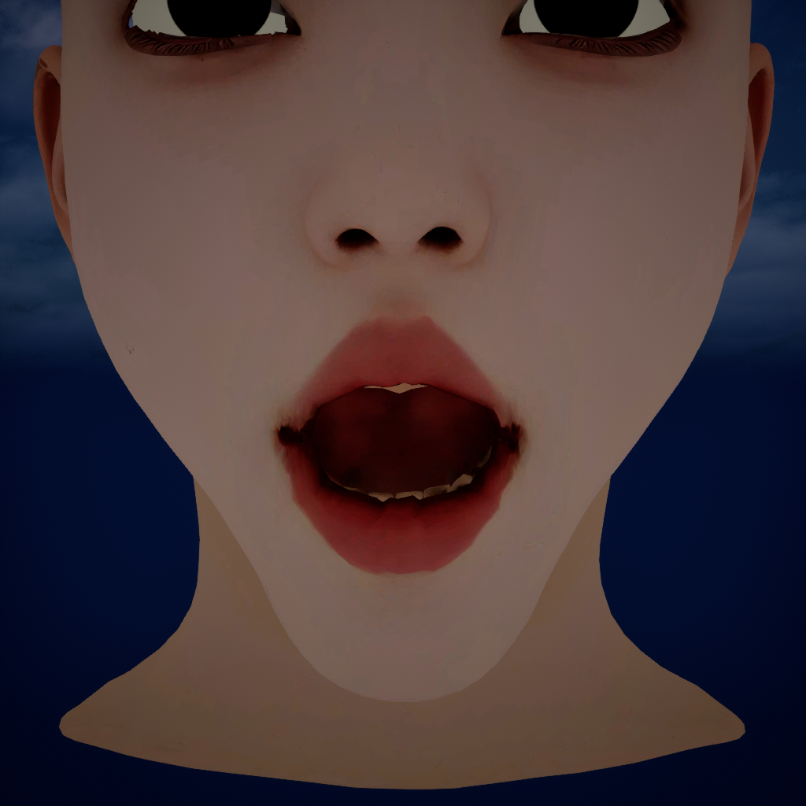
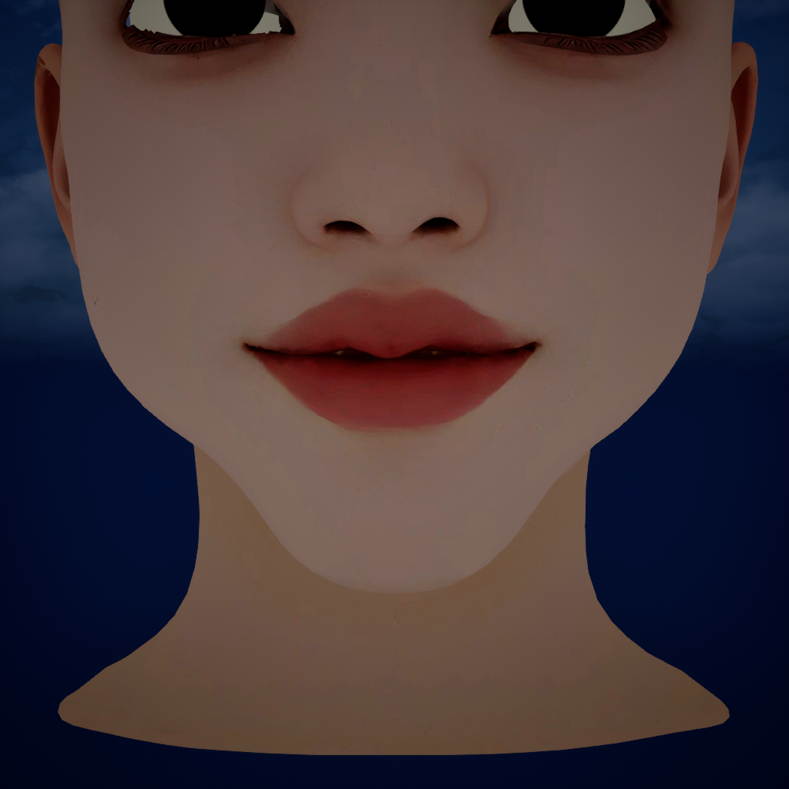

# 커스텀 얼굴 메시의 입꼬리·혀 스키닝 수정

커스텀 얼굴에 MetaHuman 리그를 적용한 뒤 발견한 입꼬리 늘어남과 혀의 잘못된 관절 영향을 수정한 기록이다. 기존 얼굴의 표면·토폴로지·UV·Shape Key를 유지하고, 입 주변과 혀의 스키닝 웨이트를 수정해 Blender·DNA·Unreal에 반영했다.

[기본 리깅 구현](HeadP2_CustomTopology_MetaHuman_Rig_Implementation.md)을 완료한 상태에서 이어지는 작업이다. Blender 5.2.2 LTS, Unreal Engine 5.7.4, Character DNA 애드온과 Ettore 기준 메타휴먼을 사용했다.

| 수정 대상 | 적용 내용 |
|---|---|
| 입 주변 2,170개 정점 | 메시 에지 연결에 따른 웨이트 평활화 |
| 혀·구강 컴포넌트 143개 정점 | 기준 메타휴먼의 혀 표면으로 대응 범위를 제한해 웨이트 재전달 |
| 최종 DNA | 수정 영역의 skin weight joint indices/values 갱신 |
| 최종 메시 | 16,880개 정점, 17,656개 면 유지. 별도 안구는 이번 수정 대상에 포함되지 않음 |

## 1. 증상과 원인 확인

### 입꼬리: 인접 정점 사이의 관절 영향 불연속

턱을 열면 양쪽 입꼬리에 얇고 긴 세로 면이 나타났다. 문제 정점의 웨이트를 확인하니 가까운 정점들이 윗입술 관절과 아랫입술 관절에 번갈아 강하게 묶여 있었다. 입이 닫힌 상태에서는 잘 드러나지 않지만, 턱이 열리면 서로 다른 방향으로 이동하면서 에지가 길게 늘어났다.

원인을 분리하기 위해 같은 턱 포즈에서 Shape Key를 적용한 결과와 Shape Key를 끈 스키닝 결과를 비교했다. 비교 중 턱 관절 행렬의 변화는 0이었다.

| 대표 에지 489–669 | 길이 |
|---|---:|
| 수정 전 중립 | 0.6907 mm |
| 수정 전 jaw 0.7, 전체 변형 | 15.4215 mm |
| 수정 전 jaw 0.7, 스키닝만 적용 | 15.3194 mm |

Shape Key를 꺼도 거의 같은 늘어남이 남았으므로, 우선 수정할 대상은 웨이트 불연속이었다. RigLogic의 관절·표정 채널 출력이 Blender와 Unreal에서 일치하더라도, 전달된 웨이트의 시각 품질까지 보장되지는 않는다.

### 혀: 치아 표면으로 잘못 전달된 웨이트

초기 전달에서는 치아와 혀가 포함된 `Ettore_teeth_lod0_mesh` 전체에서 가까운 삼각형을 찾았다. 이 과정에서 커스텀 혀의 일부가 기준 메타휴먼의 치아 표면에 대응했다.

혀로 분류한 143개 정점의 웨이트에는 `TeethLower`, `TeethUpper` 관절 영향이 섞여 있었다. 각 정점의 웨이트를 합산하면 아래 치아 계열 약 42.33, 위 치아 계열 약 15.15였다. 이는 정점 집합 전체의 영향 합계이며, 단일 정점의 웨이트나 백분율이 아니다.

이 상태에서는 턱과 혀를 움직일 때 같은 컴포넌트 안에서 치아를 따라가는 부분과 혀를 따라가는 부분이 갈라진다.

## 2. 입 주변 웨이트 수정

### 2.1 수정 영역 선택

최종 Blender 메시의 중립 좌표와 `p2_source_component` 속성으로 영역을 선택했다. 좌표 단위는 미터이며, 이 조건은 이번 P2 얼굴의 정렬 상태에 맞춘 값이다.

```python
mask = (
    (component == 0)
    & (abs(position[:, 0]) < 0.037)
    & (position[:, 2] > 1.525)
    & (position[:, 2] < 1.570)
    & (position[:, 1] < -0.085)
)
```

선택 결과는 2,170개 정점이다. 다른 얼굴에 적용할 때는 정점 그룹이나 별도 영역 마스크로 입 주변을 지정하고, 선택 영역을 중립 상태에서 확인해야 한다.

### 2.2 실제 에지 연결을 따라 평활화

각 정점에서 메시 에지로 연결된 이웃의 웨이트 평균을 구하고 다음 식으로 갱신했다. `w`는 정점의 전체 관절 웨이트 벡터다.

```text
w_new(v) = 0.5 × w_old(v) + 0.5 × mean(w_old(u), u ∈ edge_neighbors(v))
```

반복마다 이전 단계의 웨이트 배열로 평균을 계산한 뒤 선택 영역을 한 번에 갱신했다. 선택 영역 밖의 정점은 고정값으로 유지하며, 경계 정점의 평균에는 에지로 연결된 영역 밖 이웃도 포함한다.

이웃을 에지 연결로 제한하면 입을 닫았을 때 공간적으로 가까운 위·아래 입술이 거리 검색만으로 서로 섞이는 문제를 피할 수 있다. 다만 실제로 잘못 연결된 에지가 있는 메시라면 그 연결을 따라 평활화가 전파되므로, 이 방법도 토폴로지 검토가 전제다.

이번 메시에는 256회 반복을 적용했다. 반복 횟수는 원래 늘어남이 컸던 25개 에지의 jaw 0.7 변형을 비교해 결정했다. 24회와 96회에서는 최대 길이 증가량이 각각 약 4.17 mm, 3.11 mm였고, 256회에서는 2.49 mm로 줄었다.

256회는 이 메시의 검수 결과에 맞춘 값이다. 다른 얼굴에서는 과도한 평활화가 입술의 관절 분리를 약화시킬 수 있으므로 포즈를 함께 확인하며 결정한다. 정점 위치를 스무딩하는 연산은 수행하지 않았다.

### 2.3 영향 수 제한과 정규화

평활화와 혀 재전달을 마친 뒤, 수정 정점마다 다음 순서로 웨이트를 기록했다.

1. 웨이트가 큰 관절 12개를 선택한다.
2. 선택한 값 중 `1e-6` 이하를 제거한다.
3. 남은 웨이트의 합이 1이 되도록 정규화한다.
4. 해당 정점의 기존 vertex group 할당을 지우고 새 값을 기록한다.

수정 영역 밖의 웨이트는 유지했다.

## 3. 혀 웨이트 재전달

### 3.1 기준 혀 표면 추출

기준 메타휴먼을 별도 Blender 프로세스에서 열고, `Ettore_teeth_lod0_mesh`의 중립 정점 좌표·삼각형·관절 이름·웨이트를 `reference_tongue.npz`로 저장했다.

별도 프로세스로 추출한 이유는 기준 리그 오브젝트를 작업 중인 리그에 추가할 때 발생한 런타임·드라이버 충돌을 피하기 위해서다. 작업 파일에는 숫자 배열만 읽어 들인다. 이 NPZ에는 기준 메시 데이터가 들어 있으므로 공개 저장소에는 포함하지 않는다.

기준 삼각형은 다음 조건으로 제한했다.

- 이름에 `Tongue`가 포함되고 대상 리그에도 존재하는 관절의 웨이트만 사용한다.
- 삼각형을 이루는 세 정점 모두에서 해당 웨이트 합이 `0.99`를 초과해야 한다.

조건을 통과한 삼각형은 258개였다. 이 삼각형들만으로 BVH를 구성했다. 관절 이름이 다른 리그에서는 이름 필터를 실제 혀 관절 목록으로 바꿔야 한다.

### 3.2 동일한 피팅 공간에서 barycentric 전달

기준 좌표에 초기 전달 스크립트 `headp2_transfer_rig_v2.py`의 `warp()`를 그대로 적용했다. 수정 단계에서 기준 표면의 피팅을 바꾸면 기존 리깅과 대응 위치가 달라지므로 같은 함수를 재사용한다. 구현에서는 AST로 함수 정의만 읽어 전체 전달 스크립트가 실행되지 않도록 했다.

`p2_source_component == 4`인 143개 정점 각각에 대해 다음 과정을 수행했다.

1. 혀 전용 BVH에서 가장 가까운 표면점과 삼각형을 찾는다.
2. 그 표면점의 barycentric 계수 `b0`, `b1`, `b2`를 구한다.
3. 수치 오차로 범위를 벗어난 계수를 `[0, 1]`로 제한하고 합을 정규화한다.
4. 삼각형 세 정점의 혀 관절 웨이트를 보간한다.

```text
w_target(j) = b0 × w_a(j) + b1 × w_b(j) + b2 × w_c(j)
```

이후 앞 절의 최대 12개 영향 제한과 정규화를 적용했다. 결과적으로 이 컴포넌트의 혀 이외 관절 영향 합은 모든 정점에서 0이 되었다.

가장 먼 대응 거리는 약 **42.06 mm**였다. 커스텀 컴포넌트는 혀와 구강 표면이 단순화된 형태여서 기준 혀와 형상이 충분히 일치하지 않는 부분이 있다. 이번 수정은 치아 관절에 잘못 묶이는 문제를 해소했으며, 구강 내부 형태와 큰 혀 돌출 포즈의 접촉 품질은 추가 보정 대상으로 남았다.

## 4. DNA와 FBX에 반영

### 4.1 DNA 정점과 Blender 정점 대응

기존 DNA 전체를 복사한 뒤 `head_lod0_mesh`의 수정 영역에 해당하는 skin weights만 교체했다. 관절 계층·RigLogic 동작 정의·표정 채널·타깃 변위는 그대로 유지했다.

이 데이터의 DNA 헤드 정점은 UV 분리 등으로 30,500개이고, Blender 헤드 정점은 16,880개다. 따라서 Blender 정점 번호를 DNA 정점 번호로 바로 사용할 수 없다.

Blender 중립 정점으로 KD-tree를 만들고, DNA 위치를 다음과 같이 Blender 공간으로 변환해 대응 정점을 찾았다.

```python
blender_position = (dna_x * 0.01, -dna_z * 0.01, dna_y * 0.01)
```

이번 데이터의 최대 대응 오차는 약 `7.82e-8 m`였고, 스크립트는 `1e-5 m` 미만인지 검사한다. 수정된 Blender 정점에 대응하는 모든 DNA 정점에 같은 웨이트를 기록하므로 UV 경계에서 분리된 정점도 함께 갱신된다.

```python
writer.setSkinWeightsJointIndices(
    meshIndex=mesh_index, vertexIndex=dna_vertex, jointIndices=joint_ids
)
writer.setSkinWeightsValues(
    meshIndex=mesh_index, vertexIndex=dna_vertex, weights=weights
)
```

관절 인덱스는 vertex group 이름과 DNA 관절 이름으로 매칭한다. 같은 위치에 서로 다른 웨이트를 가진 정점이 겹쳐 있는 메시에는 최근접 위치 대응만으로 충분하지 않다. 그런 경우 원본 정점 ID나 명시적인 분리 정점 매핑을 사용해야 한다.

### 4.2 Blender 저장과 Unreal 재임포트

수정 후보를 `HeadP2_SkinFix.blend`와 `HeadP2_SkinFix.dna`로 저장하고 검증한 뒤, 최종 파일 `HeadP2_Rig.blend`와 `HeadP2_Complete.dna`에 반영했다. Blender 리그가 최종 DNA를 참조하도록 경로를 바꾸고 런타임을 재초기화했다.

Unreal의 실제 스키닝에 사용되는 Skeletal Mesh 웨이트도 갱신해야 하므로, 수정된 Blender 메시를 `HeadP2_Complete_CM.fbx`로 다시 내보냈다. 기존 [센티미터 단위 FBX 출력 스크립트](../tools/headp2_export_centimeters.py)를 사용했다.

Unreal에서는 다음 조건으로 기존 에셋을 교체했다.

| 항목 | 적용 값 |
|---|---|
| Skeletal Mesh | `/Game/Characters/HeadP2MetaHuman/Rig/HeadP2/SK_HeadP2` |
| Skeleton | 기존 `SK_HeadP2_Skeleton` 재사용 |
| Morph Target | 임포트 활성화, 결과 782개 |
| 기준 포즈 | `update_skeleton_reference_pose=False` |
| 머티리얼·텍스처 | 신규 임포트 끔, 기존 슬롯 이름에 따라 머티리얼 복구 |
| DNA | `DNAAssetImportFactory`에서 대상 Skeletal Mesh 명시 |
| Post Process | `ABP_Face_PostProcess` 연결 확인 |

기존 Control Rig 시퀀스의 경로도 유지했다. 재임포트 후 에디터가 강제 종료되어, 재실행한 에디터에서 저장된 에셋의 포즈 평가를 다시 확인했다. 검수 중 사용한 머티리얼 오버라이드와 키를 추가하지 않은 혀 테스트 값은 복구하고, 중립 프레임으로 돌려놓았다.

## 5. 검증 결과와 남은 보정

### 5.1 수정 전후 비교

수정 전 백업과 최종 Blender 파일을 다시 열어 비교했다.

| 검증 항목 | 결과 |
|---|---|
| Basis 좌표 | 동일 |
| 면 연결 | 동일 |
| 활성 UV 레이어 | 동일 |
| Shape Key 이름·좌표 | 동일 |
| 웨이트 변경 정점 | 2,313개, 컴포넌트 0과 4에 한정 |
| 미할당 정점 | 0개 |
| 웨이트 합 최대 오차 | 약 `2.44e-6` |
| 혀의 비혀 관절 영향 | 0 |

검증 스크립트는 Basis·면 연결·UV·Shape Key 배열의 해시와 정점별 웨이트를 비교한다. DNA의 skin weight 변경과 Blender 표면 보존은 각각 다른 데이터 계층의 변경·검증이다.

### 5.2 변형 검사

Blender에서 중립, jaw 0.7, jaw 1.0, smile 0.7, jaw+smile, 턱을 연 상태의 혀 앞뒤 이동을 확인했다.

| 측정 항목 | 수정 후 |
|---|---:|
| 대표 에지 489–669, jaw 0.7의 최종 길이 | 3.0401 mm |
| 진단 에지 25개의 최대 길이 증가, jaw 0.7 | 2.4931 mm |
| 같은 에지 집합의 최대 길이 증가, jaw 1.0 | 3.8159 mm |
| 같은 에지 집합의 최대 길이 증가, smile 0.7 | 0.5816 mm |
| 같은 에지 집합의 최대 길이 증가, jaw+smile | 2.5200 mm |

대표 에지의 jaw 0.7 길이는 **15.4215 → 3.0401 mm**로 줄었다. 위 수치는 초기 진단에서 선택한 에지 집합에 대한 값이다. 자동 통과 조건은 jaw 0.7에서 이 집합의 최대 증가량이 3 mm 미만이고, 혀의 비혀 관절 영향이 `1e-6` 미만인 것이다. 모든 표정의 품질을 보증하는 기준으로 사용하지 않는다.

Unreal에서는 중립 0프레임, 입 벌림 20프레임, 미소 100프레임과 혀 컨트롤을 재확인했다. jawOpen과 mouthCornerPull의 입력 0.7에 대응하는 커브 평가, 782개 Morph Target, `ABP_Face_PostProcess` 연결을 확인했다. Unreal Skeletal Mesh의 본 수는 876개이며, 기본 구현에서 기록한 DNA 관절 870개와는 집계 대상이 다르다.

**입 벌림 수정 후 — Unlit 텍스처 검수**



**미소 수정 후 — Unlit 텍스처 검수**



입꼬리의 긴 세로 늘어남은 줄었다. 작은 주름·틈과 단순화된 구강 내부 형태는 남아 있다. 특히 혀를 크게 내미는 포즈에서는 원본 구강 표면과 입술이 겹친다. 추가 작업에서는 구강·혀 형태 정리와 포즈별 corrective를 검토해야 한다. 이번 작업에서는 표면 보존 조건에 따라 웨이트 수정까지만 적용했다.

## 부록 A. 재현 순서와 스크립트

스크립트는 이번 모델에 사용한 작업 기록이다. `out`, 수정 전 백업 경로, 오브젝트 이름, 컴포넌트 번호, 영역 좌표를 자신의 데이터에 맞춰 수정한다. 파일 이름의 `Donor`는 기존 산출물 이름이며 문서의 **기준 메타휴먼**을 뜻한다.

준비할 입력은 수정 전 `HeadP2_Rig.blend`·`HeadP2_Complete.dna`, 기준 리그 `Ettore_Donor_Full.blend`, 초기 전달 스크립트, `lip_diagnosis.json`이다. 수정 전 BLEND·DNA·FBX와 Unreal 에셋은 별도 백업한다. 수정 스크립트의 입력은 항상 이 백업을 가리켜야 반복 실행 때 평활화가 누적되지 않는다.

| 순서 | 스크립트 | 역할 |
|---|---|---|
| 1 | [headp2_reference_tongue.py](../tools/headp2_reference_tongue.py) | 별도 Blender 프로세스에서 기준 메시 배열 추출 |
| 2 | [headp2_fix_lip_tongue.py](../tools/headp2_fix_lip_tongue.py) | 입 주변 평활화, 혀 재전달, 후보 BLEND·DNA 저장 |
| 3 | [headp2_skin_fix_review.py](../tools/headp2_skin_fix_review.py) | 후보 포즈 평가·렌더·진단 에지 검사 |
| 4 | [headp2_skin_preservation.py](../tools/headp2_skin_preservation.py) | 수정 전 백업과 후보의 표면·UV·Shape Key·웨이트 비교 |
| 5 | [headp2_promote_skin_fix.py](../tools/headp2_promote_skin_fix.py) | 검증 결과 확인 후 최종 BLEND·DNA 갱신 |
| 6 | [headp2_export_centimeters.py](../tools/headp2_export_centimeters.py) | 최종 Blender 메시를 FBX로 출력 |
| 7 | [headp2_ue_skin_fix_import.py](../tools/headp2_ue_skin_fix_import.py) | 기존 Unreal 메시·DNA 갱신 및 연결 복구 |

1~6은 각각 별도 Blender 프로세스에서 실행한다. 예를 들어 PowerShell에서는 다음과 같이 호출한다.

```powershell
& 'C:/Program Files/Blender Foundation/Blender 5.2/blender.exe' `
  --background --python 'D:/YourTools/headp2_reference_tongue.py'
```

2번 스크립트는 `out/Tools/headp2_transfer_rig_v2.py`에서 `warp()`를 읽는다. 해당 위치에 [초기 전달 스크립트](../tools/headp2_transfer_rig_v2.py)를 배치하거나 참조 경로를 수정한다. 3번은 [lip_diagnosis.json](../verification/skin_fix/lip_diagnosis.json)을 `out`에서 읽는다.

공개한 4번 스크립트의 비교 대상은 승격 전 후보 `HeadP2_SkinFix.blend`다. 최종 반영 후에는 비교 대상을 `HeadP2_Rig.blend`로 바꾸고 다시 실행한다. 이번 작업에서는 이 최종 재검사까지 수행했다.

7번은 열린 Unreal 에디터의 Python에서 실행한다. 이후 기존 표정 시퀀스에서 입 벌림·미소·혀 포즈를 직접 검수하고, 임시 머티리얼과 컨트롤 값을 복구한다. 임포트 성공만으로 검수를 완료 처리하지 않는다.

## 부록 B. 검증 자료

- [수정 영역·혀 대응 거리](../verification/skin_fix/skin_fix_candidate.json)
- [입꼬리 초기 진단](../verification/skin_fix/lip_diagnosis.json)
- [Blender 포즈 검사](../verification/skin_fix/skin_fix_review.json)
- [최종 BLEND 보존 검사](../verification/skin_fix/skin_fix_preservation.json)
- [최종 수정 검증 기록](../verification/skin_fix/skin_fix_verification.json)

기존 `verification/final_verification.json`은 최초 리깅 완료 시점의 기록이다. 이번 수정 결과는 `verification/skin_fix/`에 별도로 보관한다. 모델·DNA·기준 메시 배열·플러그인 바이너리는 저장소에 포함하지 않는다.
